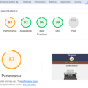
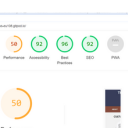

# The Review - A Cultural Criticism Platform

## About The Project
"The Review" is an innovative online platform dedicated to the art of cultural criticism, with a special focus on books and movies. Our mission is to cultivate a vibrant community where enthusiasts can explore, share, and engage in discussions about their favorite cultural works. Through seamless navigation and a user-friendly design, "The Review" aims to encourage active participation and foster a sense of belonging among its members.

## Objectives
- To provide a trusted platform for exploring and sharing in-depth reviews on a broad spectrum of books and movies.
- To stimulate interactions and build a community bound by a shared passion for cultural criticism.
- To ensure an enjoyable user experience with an attractive and responsive website design.
- To expand our digital footprint and engage with the community through various social media channels.

## Built With
This project leverages the foundational web technologies:
- **HTML5**: For structuring content.
- **CSS3**: For styling and responsive design.

## Key Features

- **Diverse Reviews**: Users can delve into comprehensive reviews of a wide array of books and movies, enriching their cultural insights.
- **Ease of Navigation**: Designed for simplicity, the website allows users to effortlessly locate their interests.
- **Responsive Layout**: Ensures a seamless viewing experience across different devices, from mobile phones to desktop computers.
- **Community Engagement**: Facilitates registration for users wishing to contribute their own reviews and engage with others within the community.

## Getting Started

### Prerequisites
- A modern web browser capable of interpreting HTML5 and CSS3.

### Installation
- No special installation required. Simply clone the repository and open the HTML files in your web browser to explore "The Review".

## Validator Testing

**HTML Validation**:
- No errors or warnings across all pages (index.html, book-cover.html, movie-cover.html, sign.html).
  #### book-cover.html
  

  #### index.html:
  

  #### movie-cover.html:
  

  #### sign.html:
  

  

  

**CSS Validation**:
- All CSS files (book.css, index.css, sign.css, style.css) passed validation with no errors found.

## Accessibility

Ensuring accessibility for all users is a cornerstone of "The Review". Our platform was rigorously tested to guarantee an inclusive user experience, with exemplary scores in both desktop and mobile accessibility assessments.

- **Desktop Accessibility**:

- **Mobile Accessibility**:

## Unfixed Bugs

Currently, there are no known unfixed bugs in the project.

## Deployment

"The Review" is hosted on GitHub Pages. To deploy your own version:
1. Upload all necessary files to your GitHub repository.
2. Go to the repository's settings, navigate to the "Pages" section.
3. In the "Source" dropdown, select the main branch containing your project files.

The Review" is hosted on GitHub Pages. You can access the live site via the following link: [The Review](https://badralioui.github.io/project1-codeInstitutte/)

Your site should now be live on GitHub Pages!

## Manual Testing User Stories

| User Story | Testing |
| --- | --- |
| As a first-time user, I want to know what the website is about | Clicking on the "About Us" navigation link or scrolling down will take the user to the "About Us" section where they will find information about the purpose and the theme of the website. |
| As a first-time user, I want to explore book and movie reviews | The homepage prominently features sections for both "Book Reviews" and "Movie Reviews". Clicking on either section or using the navigation bar allows users to dive into a rich collection of reviews. |
| As a first-time user, I am interested in how I can contribute to the site | Scrolling to the "Join Us" or "Contribute" section, accessible through the navigation bar, guides users on how to submit their own reviews and become a part of the community. |
| As a first-time user, I want to follow the site on social media | Social media links are conveniently located in the footer on every page, allowing users to connect with "The Review" on various social platforms. |
| As a returning user, I want to sign up for the newsletter | Users can find the newsletter sign-up form in the footer or as a dedicated section titled "Stay Updated" where they can easily subscribe to receive updates. |
| As a returning user, I am interested in attending events related to books and movies | Information about upcoming events can be found

### Browser Compatibility
The website is fully functional and has been thoroughly tested across three major web browsers: Firefox, Microsoft Edge, and Google Chrome. During testing, it was ensured that all features operate seamlessly and the user experience remains consistent regardless of the browser choice. This cross-browser compatibility underscores our commitment to providing an accessible and reliable platform for all users, ensuring that everyone can enjoy the rich content and interactive features of "The Review" without any limitations.

## Future Enhancements

- **Burger Menu**: Implementation of a burger menu for an optimized mobile navigation experience.
- **Dynamic Content**: Real-time updates for reviews, ratings, and community interactions.
- **Inclusivity**: Further diversification of content to include a wider range of cultural works and critical perspectives.

## Credits
### Imagery
All images used on "The Review" website are sourced from [Unsplash](https://unsplash.com/), Additional images were carefully selected through [Amazon](https://www.amazon.com/), [Google's advanced image search ](https://www.google.com/search?q=machine+%C3%A0+%C3%A9crire&tbm=isch&ved=2ahUKEwj0isX_ueKEAxXAoP0HHU5oA00Q2-cCegQIABAA&oq=machine+a+e&gs_lp=EgNpbWciC21hY2hpbmUgYSBlKgIIADIFEAAYgAQyBRAAGIAEMgUQABiABDIFEAAYgAQyBRAAGIAEMgUQABiABDIEEAAYHjIEEAAYHjIEEAAYHjIEEAAYHkjQTlDaCljqQ3AAeACQAQCYAacBoAH8CaoBAzcuNbgBAcgBAPgBAYoCC2d3cy13aXotaW1nqAIAwgIKEAAYgAQYigUYQ4gGAQ&sclient=img&ei=ZNvpZfTIOsDB9u8PztCN6AQ&bih=571&biw=1280), [IMDb](www.imdb.com) and [wordpress](https://wordpress.com/)

## Acknowledgements
- My Mentor Rahul for his ongoing support and feedback
- The Code Institute's Tutor Support
